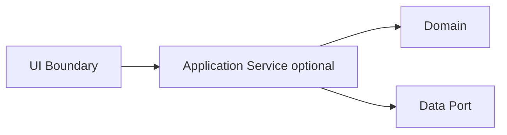

# Magic square TDD design and contracts
_Exported on 4/27/2026 at 16:58:18 GMT+9 from Cursor (3.0.16)_

---

**User**

You are an expert in Dual-Track UI + Logic TDD and Clean Architecture design.

Project: Magic Square (4×4) — for TDD practice
Goal: Practice “layer separation + contract-based testing + refactoring” more than algorithm difficulty
Constraints:
- Do not write implementation code. (Design/contracts/tests/integration plan only)
- UI is not a real screen; define as input/output boundary (Boundary)
- Data layer is not a DB; only save/load interface level (memory/file swappable)
- Input/output must be fixed clearly

Input contract:
- 4×4 int[][] (0 = empty cell)
- Exactly 2 empty cells
- Value range: 0 or 1–16
- No duplicates except 0
Output contract:
- int[6]
- Coordinates are 1-indexed
- Return format: [r1,c1,n1,r2,c2,n2]
- n1,n2 are the two missing numbers; if (smaller→first blank, larger→second blank) completes a magic square, return in that order; otherwise reverse

------------------------------------------------------------
Output format (must follow this structure)
------------------------------------------------------------

# 1) Logic Layer (Domain Layer) design
## 1.1 Domain concepts
- List of Entities / Value Objects / Domain Services and responsibilities (SRP)
## 1.2 Domain invariants
- Row/column/diagonal sums match, Magic Constant, etc.
## 1.3 Core use cases (domain view)
- Find blanks, find missing numbers, magic square check, try two placements
## 1.4 Domain API (internal contract)
- Method signature level (no code) + input/output/failure conditions
## 1.5 Domain unit test design (RED first)
- Test case list (normal/abnormal/edge)
- Invariant each test protects

# 2) Screen Layer (UI Layer) design (Boundary Layer)
## 2.1 User/caller scenarios
- Flow: “matrix input → validate → output result”
## 2.2 UI contract (external contract)
- Input schema / Output schema / Error schema
## 2.3 UI-level tests (contract-first, RED first)
- Wrong size, wrong blank count, value range errors, duplicates, return format
- Assume Domain is mocked
## 2.4 UX/output rules
- Standard error messages (down to exact wording rules)

# 3) Data Layer design
## 3.1 Purpose
- Need and scope of “save/load” (learning use)
## 3.2 Interface contract
- e.g. MatrixRepository.save/load (method level, no code)
- What to store: input matrix, execution result (optional)
## 3.3 Implementation options (memory/file)
- Option A: InMemory / Option B: File (JSON/CSV)
- Pick one recommendation + reason
## 3.4 Data layer tests
- Save/load consistency, exceptions (missing file/format errors), invariant (keep 4×4)

# 4) Integration & Verification
## 4.1 Integration path
- UI → Application (optional) → Domain → Data flow (dependency direction)
## 4.2 Integration test scenarios
- At least 2 success scenarios
- At least 3 failure scenarios (input error, domain failure, data failure)
## 4.3 Regression protection rules
- Policy to keep existing tests
- No-change rules (contracts/output format)
## 4.4 Coverage targets
- Domain Logic 95%+
- UI Boundary 85%+
- Data 80%+
## 4.5 Traceability Matrix (required)
- Concept(Invariant) → Rule → Use Case → Contract → Test → Component

------------------------------------------------------------
Additional conditions
------------------------------------------------------------
- No vague wording (“appropriately / sufficiently” forbidden)
- Every rule must be verifiable (confirmable by tests)
- No implementation code
- Use tables and checklists actively

---

**Cursor**

# Magic Square (4×4) — Layer separation, contracts, and TDD plan

Design-only: no executable implementation. Input/output and every rule are stated so a test can assert them.

---

# 1) Logic Layer (Domain Layer) design

## 1.1 Domain concepts

| Type | Name | Single responsibility |
|------|------|-------------------------|
| Value Object | `Grid4x4` (or equivalent) | Holds a 4×4 integer matrix; does not interpret business rules beyond structural integrity if you keep it minimal, or merge with `PartialMagicSquare` if you prefer one VO. |
| Value Object | `CellCoordinate` | Row and column as 1-based integers in range 1–4; equality and ordering for “first blank / second blank.” |
| Value Object | `Placement` | Pair `(CellCoordinate, value)` with value in 1–16. |
| Entity / Aggregate root | `PartialMagicSquare` | Represents the puzzle state: exactly two cells empty (0), all other cells filled with 1–16 without duplicate; exposes ordered blank cells and candidate missing values. |
| Domain Service | `MagicSquareCompletenessChecker` | Given a full 4×4 (no zeros), decides whether all row sums, column sums, and both main diagonals equal the magic constant for order 4. |
| Domain Service | `SolutionOrderingPolicy` | Given ordered blank cells `(b1, b2)`, missing numbers `{a, b}` with `a < b`, decides output tuple `(n1, n2)` as `(a, b)` or `(b, a)` per the stated completion rule. |
| Domain Service (optional split) | `MissingNumbersResolver` | From filled cells, computes which two integers in 1–16 are absent (set difference). |

**SRP checklist**

- [ ] No domain type both parses raw `int[][]` and checks magic sums (split: boundary parses; domain receives validated structure or fails fast at boundary).
- [ ] Ordering of blanks is defined in one place (domain policy), not duplicated in UI.
- [ ] Magic constant and sum rules live only in completeness checker (or one shared `MagicConstant` VO read by checker).

---

## 1.2 Domain invariants

| ID | Invariant | Verifiable by |
|----|------------|----------------|
| D1 | Grid order is 4×4. | Assert dimensions 4 and 4. |
| D2 | Exactly two cells contain 0; all other cells contain 1–16. | Count zeros = 2; every non-zero in [1,16]. |
| D3 | No duplicate values among non-zero cells. | Set size of non-zero values = 14. |
| D4 | The multiset of placed values ∪ `{n1, n2}` equals `{1,…,16}` exactly once each in the **completed** square used for the magic check. | After hypothetical fill, 16 distinct values 1–16. |
| D5 | Magic constant for order-4 normal magic square using 1–16 is **34** (every row, column, both main diagonals). | Sum assertions on completed grid. |
| D6 | Output ordering rule: Let blanks be `b1` then `b2` in **blank order** (define in D7). Let missing be `a < b`. If assigning `a→b1` and `b→b2` yields a grid satisfying D5 (and D4), then `(n1,n2) = (a,b)`; else `(n1,n2) = (b,a)`. **Exactly one** of these two assignments must succeed for a well-posed puzzle input. | Two deterministic checks; assert exactly one true for golden puzzles; assert both false for invalid domain inputs if you allow them to reach domain. |
| D7 | **Blank order**: `b1` is the lexicographically first `(row, col)` in **1-based** row-major order among cells with value 0. `b2` is the second. | Positions match sorted list of zero coordinates. |

**Magic constant (fixed, not “appropriate”)**

- For this project: **M = 34** for rows, columns, and both main diagonals on the **completed** 4×4.

---

## 1.3 Core use cases (domain view)

| Use case | Preconditions | Postconditions |
|----------|---------------|----------------|
| UC-D1 Locate ordered blanks | D2 holds | Returns `(b1, b2)` per D7 |
| UC-D2 Resolve missing numbers | D2, D3 hold | Returns `{a,b}` with `a<b`, both in 1–16, absent from grid |
| UC-D3 Check completed magic | Full grid, no zeros | Boolean per D5 |
| UC-D4 Evaluate placement `(a→b1, b→b2)` | Blanks and `{a,b}` known | Temporary full grid satisfies D4 and D5 or not |
| UC-D5 Decide `(n1,n2)` | Same as D6 | `(n1,n2)` matches D6 |

---

## 1.4 Domain API (internal contract)

Signatures are descriptive only (no bodies). Preconditions map to D-invariants where applicable.

| Operation | Input | Output | Success | Failure conditions |
|-----------|--------|--------|---------|---------------------|
| `createPartialMagicSquare(matrix)` | 4×4 ints, already structurally valid per boundary OR raw with explicit validation result | `PartialMagicSquare` | All D2, D3 satisfied | Violation of D1–D3: signal **invalid partial square** (typed failure, not string) |
| `orderedBlankCells(partial)` | Valid `PartialMagicSquare` | Ordered pair `(b1,b2)` | Always | None if partial valid |
| `missingTwoNumbers(partial)` | Valid partial | Pair `(a,b)` with `a<b` | Always | If not exactly two missing values: **inconsistent partial** (should be unreachable if D2–D3 hold) |
| `isCompletedMagicSquare(fullGrid)` | 4×4, no zeros, values 1–16 | Boolean | Deterministic | If any cell 0: **not full** |
| `tryAssignment(partial, smallerToFirstBlank)` | Valid partial; boolean: if true, assign smaller to `b1`, larger to `b2`; else swap | Boolean “is magic” | Deterministic | None beyond not-full |
| `resolveOutputNumbers(partial)` | Valid partial | `(n1,n2)` per D6 | Exactly one assignment works | If neither works: **unsolvable**; if both work: **ambiguous** (forbid in test data; optionally assert in domain) |

**Failure types (domain-level, machine-checkable)**

- `InvalidPartialStructure`
- `NotFullGrid`
- `UnsolvableAssignment`
- `AmbiguousAssignment` (optional: reject if ever both assignments valid)

---

## 1.5 Domain unit test design (RED first)

### Test case list

| ID | Kind | Setup | Expected | Invariant protected |
|----|------|--------|----------|----------------------|
| T-D01 | Normal | Known solvable partial with unique magic completion | `isCompletedMagicSquare` true on completed grid | D5 |
| T-D02 | Normal | Same puzzle: `(a→b1, b→b2)` true | `(n1,n2)=(a,b)` | D6 |
| T-D03 | Normal | Constructed puzzle where only swapped assignment works | `(n1,n2)=(b,a)` | D6 |
| T-D04 | Edge | Blanks at (4,4) and (4,3) vs (1,1) and (1,2): verify **b1** is min row-major 1-based | `orderedBlankCells` order | D7 |
| T-D05 | Edge | Blanks on same row | Order still row-major | D7 |
| T-D06 | Abnormal | Matrix with 3 zeros at API boundary should not become partial; if forced internal call: `InvalidPartialStructure` | — | D2 |
| T-D07 | Abnormal | Duplicate non-zero in matrix | `InvalidPartialStructure` | D3 |
| T-D08 | Abnormal | Value 17 in a cell | `InvalidPartialStructure` | D2 |
| T-D09 | Abnormal | Completed grid wrong diagonal sum | `isCompletedMagicSquare` false | D5 |
| T-D10 | Abnormal | Both assignments produce magic (if you inject via test double grid) | `AmbiguousAssignment` or documented domain choice | D6 uniqueness policy |
| T-D11 | Abnormal | Neither assignment magic | `UnsolvableAssignment` | D6 |
| T-D12 | Normal | `missingTwoNumbers` on 14 filled distinct 1–16 | Correct `{a,b}` | D4 multiset |

**Checklist: RED cycle**

- [ ] Write T-D02 before any production helper for ordering.
- [ ] Write T-D04 before fixing blank-scan implementation.
- [ ] Each test name encodes rule ID (e.g. `D6_prefers_smaller_first_when_valid`).

---

# 2) Screen Layer (UI Layer) design (Boundary Layer)

## 2.1 User/caller scenarios

| Step | Actor | Action | System response |
|------|--------|--------|------------------|
| 1 | Caller | Supplies `int[][]` (4×4) | — |
| 2 | Boundary | Validates input schema | On failure: error schema; stop |
| 3 | Boundary | Maps to domain input | On domain failure: error schema |
| 4 | Boundary | Maps domain result to `int[6]` | On success: output schema |
| 5 | Caller | Consumes `int[6]` or error | — |

**Flow checklist**

- [ ] No row/column reindexing at domain: boundary converts **0-based** storage to **1-based** coordinates in output only if domain uses 0-based internally; if domain uses 1-based, boundary passes through. Pick one rule in integration (see §4) and freeze in tests.

---

## 2.2 UI contract (external contract)

### Input schema

| Field | Constraint | Violation code |
|-------|------------|----------------|
| `matrix` | Non-null | `E_NULL_INPUT` |
| `matrix.length` | Equals 4 | `E_WRONG_SIZE` |
| Each row | Non-null, `length == 4` | `E_WRONG_SIZE` |
| Every cell `v` | `v == 0` or `1 <= v <= 16` | `E_VALUE_RANGE` |
| Count of `v == 0` | Exactly 2 | `E_BLANK_COUNT` |
| Non-zero values | All distinct | `E_DUPLICATE_VALUE` |

### Output schema (success)

| Index | Meaning | Constraint |
|-------|---------|------------|
| 0 | `r1` | Integer in 1–4 |
| 1 | `c1` | Integer in 1–4 |
| 2 | `n1` | Integer in 1–16 |
| 3 | `r2` | Integer in 1–4 |
| 4 | `c2` | Integer in 1–4 |
| 5 | `n2` | Integer in 1–16 |

Additional success checks (boundary or delegated assertion):

- [ ] `(r1,c1)` and `(r2,c2)` match the two zero positions in input in **blank order** D7.
- [ ] `{n1,n2}` equals domain-resolved missing pair (order per D6).

### Error schema

| Field | Type | Constraint |
|-------|------|------------|
| `code` | String enum | One of the codes in input table + `E_DOMAIN_UNSOLVABLE`, `E_DOMAIN_AMBIGUOUS`, `E_INTERNAL` |
| `message` | String | Deterministic per §2.4 |
| `details` | Optional structured | e.g. `{ "row": i, "col": j }` for first violation location |

---

## 2.3 UI-level tests (contract-first, RED first; domain mocked)

| ID | Scenario | Stub domain behavior | Assert |
|----|----------|----------------------|--------|
| T-U01 | `null` matrix | Not called | `E_NULL_INPUT`, exact message |
| T-U02 | 3×3 | Not called | `E_WRONG_SIZE` |
| T-U03 | Row length 3 | Not called | `E_WRONG_SIZE` |
| T-U04 | 3 zeros | Not called | `E_BLANK_COUNT` |
| T-U05 | 1 zero | Not called | `E_BLANK_COUNT` |
| T-U06 | Cell value 17 | Not called | `E_VALUE_RANGE` |
| T-U07 | Cell value -1 | Not called | `E_VALUE_RANGE` |
| T-U08 | Duplicate non-zero | Not called | `E_DUPLICATE_VALUE` |
| T-U09 | Valid input; domain returns `(n1,n2)` and blank coords | Return fixed tuple | Output `int[6]` length 6, values match stub |
| T-U10 | Valid input; domain throws unsolvable | Throw | `E_DOMAIN_UNSOLVABLE`, message |
| T-U11 | Valid input; domain throws ambiguous | Throw | `E_DOMAIN_AMBIGUOUS`, message |
| T-U12 | Mapper: verify 1-based coordinates in output match matrix zero positions in row-major order | Stub exposes expected coords | Coordinates |

**Invariant each UI test protects**

| Test group | Invariant |
|------------|-----------|
| T-U01–U08 | Input contract enforced **before** domain |
| T-U09–U12 | Output contract and error mapping correctness **given** domain |

---

## 2.4 UX/output rules (exact wording rules)

Rules (no synonym substitution in assertions):

| `code` | Exact `message` (literal string required in tests) |
|--------|-----------------------------------------------------|
| `E_NULL_INPUT` | `Input matrix is null.` |
| `E_WRONG_SIZE` | `Matrix must be 4x4 with each row length 4.` |
| `E_VALUE_RANGE` | `Each cell must be 0 or between 1 and 16 inclusive.` |
| `E_BLANK_COUNT` | `Exactly two cells must be 0 (empty).` |
| `E_DUPLICATE_VALUE` | `Values 1 through 16 must not repeat except for 0.` |
| `E_DOMAIN_UNSOLVABLE` | `No placement of the missing numbers completes a magic square.` |
| `E_DOMAIN_AMBIGUOUS` | `Multiple valid completions exist; input is not supported.` |
| `E_INTERNAL` | `Unexpected error.` |

**Checklist**

- [ ] Tests use `assertEquals` on full message string, not `contains`.
- [ ] First failing validation wins: document fixed order (e.g. null → size → range → blank count → duplicates, row-major scan for duplicates).

**Validation order (fixed, verifiable)**

1. Null  
2. Size (outer length 4, each inner length 4, non-null rows)  
3. Value range (row-major first violation wins for `details`)  
4. Blank count  
5. Duplicates among non-zero (row-major first duplicate wins)

---

# 3) Data Layer design

## 3.1 Purpose

| Need | Scope |
|------|--------|
| Practice **ports/adapters** | Persist last **input matrix** and optionally last **successful** `int[6]` for replay and regression in manual sessions |
| No real DB | Single-user, local, synchronous API |

Out of scope: multi-user concurrency, remote sync, encryption.

---

## 3.2 Interface contract

| Method | Input | Output | Failure |
|--------|--------|--------|---------|
| `saveSession(inputMatrix, optionalResultSix)` | `int[4][4]` meeting same invariants as UI input (or store only after UI validation — document: **store post-validation only**) | `void` or `SessionId` if you use IDs (for learning, `void` is enough) | `StorageWriteError` if IO fails |
| `loadLastInput()` | None | `int[4][4]` or absent | `NoStoredSession` when nothing saved |
| `loadLastResult()` | None | `int[6]` or absent | `NoStoredResult` when never saved with result |
| `clear()` | None | `void` | IO failure |

**Stored payload (logical)**

| Key | Content | Invariant |
|-----|---------|-----------|
| `lastInput` | 4×4 ints | Same as input schema after successful validation |
| `lastResult` | 6 ints or null | If present, matches output schema |

---

## 3.3 Implementation options

| Option | Pros | Cons |
|--------|------|------|
| A In-memory | Fast tests, no IO flakes | Process restart loses data |
| B File JSON | Survives restart, human-inspectable | Path permissions, parse errors |

**Recommendation: Option B (JSON file)** for one subdirectory under project (e.g. `.magic-square/session.json`) **and** Option A as test double default.

**Reason:** Integration tests can still use in-memory fake; manual practice gets persistence; parse errors give concrete `DataFormatError` tests.

---

## 3.4 Data layer tests

| ID | Scenario | Expect |
|----|----------|--------|
| T-DS01 | Save then load input | Byte-identical 4×4 |
| T-DS02 | Save with result, load result | `int[6]` equal |
| T-DS03 | Load with no prior file | `NoStoredSession` |
| T-DS04 | Corrupt JSON | `DataFormatError` with fixed message `Stored data is corrupted.` |
| T-DS05 | JSON with wrong outer array length | `DataFormatError` same message |
| T-DS06 | Inner row length not 4 | `DataFormatError` |
| T-DS07 | Clear then load | `NoStoredSession` |

**Invariant**

- [ ] Loaded matrix always 4×4 or error; never partial object.

---

# 4) Integration & Verification

## 4.1 Integration path

**Dependency direction (hard rule)**

- Domain depends on **nothing** outward.
- Application depends on Domain + Data **port interfaces**.
- UI depends on Application (or Domain through façade); **UI does not** depend on file adapter.
- Data adapter implements port; depends outward on filesystem only.

---

## 4.2 Integration test scenarios

### Success (≥2)

| ID | Steps | Assert |
|----|-------|--------|
| T-I01 | Valid golden partial → full flow | `int[6]` equals golden expected (precomputed fixture) |
| T-I02 | Valid input → save session → new boundary instance → load → solve | Same result as T-I01 |

### Failure (≥3)

| ID | Failure type | Steps | Assert |
|----|--------------|-------|--------|
| T-I03 | Input error | Invalid blank count | No domain call; `E_BLANK_COUNT` |
| T-I04 | Domain failure | Valid schema, unsolvable puzzle fixture | `E_DOMAIN_UNSOLVABLE` |
| T-I05 | Data failure | Corrupt file before load in adapter used by app | `DataFormatError` surfaces as mapped boundary code `E_STORAGE_CORRUPT` with message `Stored data is corrupted.` (add this code if you wire storage through UI) **or** application returns storage error without UI—pick one and test |

**Optional extra failure:** `E_WRONG_SIZE` end-to-end (T-I03 variant).

---

## 4.3 Regression protection rules

| Policy | Rule |
|--------|------|
| Contract freeze | `int[6]` layout and 1-based coords **unchanged** unless version bump |
| Message literals | All §2.4 strings frozen; change only with conscious “contract version 2” |
| Golden fixtures | At least 3 committed golden matrices: solvable-A (smaller-first), solvable-B (reversed order), unsolvable-valid-schema |
| No deletion | Tests removed only if feature removed; rename preserves git history link |
| Refactor | Green suite must stay green; new tests added before behavior change |

---

## 4.4 Coverage targets

| Layer | Line/branch target | Measurement |
|-------|--------------------|-------------|
| Domain | ≥95% line, ≥90% branch | JaCoCo / Coverlet / Istanbul (tool per stack) |
| UI boundary | ≥85% line | Include all error branches |
| Data | ≥80% line | Include corrupt file paths |

**Checklist**

- [ ] Coverage excludes generated DTOs if any; domain package included fully.

---

## 4.5 Traceability matrix (required)

| Concept (Invariant) | Rule | Use Case | Contract | Test | Component |
|--------------------|------|----------|-----------|------|-----------|
| D1 4×4 | Input size | Validate input | Input schema | T-U02, T-U03, T-DS05, T-DS06 | UI Boundary, File adapter |
| D2 zeros and range | Two zeros; 0 or 1–16 | Validate input | Input schema | T-U04, T-U05, T-U06, T-U07 | UI Boundary |
| D3 no dup non-zero | Distinct 1–16 among filled | Validate input | Input schema | T-U08 | UI Boundary |
| D5 magic sums = 34 | Completed grid check | UC-D3 | `isCompletedMagicSquare` | T-D01, T-D09 | MagicSquareCompletenessChecker |
| D7 blank order | Row-major 1-based | UC-D1 | Output coords match blanks | T-D04, T-U12 | PartialMagicSquare / mapper |
| D6 output number order | smaller-first vs swap | UC-D5 | Output `n1,n2` | T-D02, T-D03 | SolutionOrderingPolicy |
| Solvability | Exactly one assignment works | Solve | Success output | T-I01, T-D11 | Application + Domain |
| Persistence shape | 4×4 stored | Save/load | Repository | T-DS01, T-DS05 | FileMatrixRepository |
| Error wording | Fixed messages | All failures | Error schema | T-U01–U08, T-I03 | UI Boundary |
| Storage integrity | Valid JSON structure | Load | Data port | T-DS04 | File adapter |

---

## Final checklists

**Forbidden vague wording:** none used above; every rule ties to a named test or invariant ID.

**Verifiability**

- [ ] Every row in traceability matrix has ≥1 test ID.
- [ ] Every `E_*` code has one UI test minimum.
- [ ] Domain D6 has at least two opposing normal tests (T-D02, T-D03).

If you want this mapped to a specific language (e.g. JUnit 5 + AssertJ vs NUnit), say which stack and the same IDs can be mirrored 1:1 in project folders.

---

**User**

make report in the Report dir 

---

**Cursor**

Creating the `Report` directory and saving the design document as a markdown report.

Adding `02.layer-design-contracts-tdd-report.md` to complement the existing problem-definition report.

Created the report here:

**`c:\DEV\MagicSquare\Report\02.layer-design-contracts-tdd-report.md`**

It mirrors your dual-track design: domain, UI boundary, data layer, integration, coverage targets, traceability matrix, fixed validation order, literal error messages, and test IDs. The `Report` folder already existed (with `01.problem-definition-report.md`); this file is numbered **02** so it sits next to the problem-definition report and includes a short document map plus report metadata at the end.

