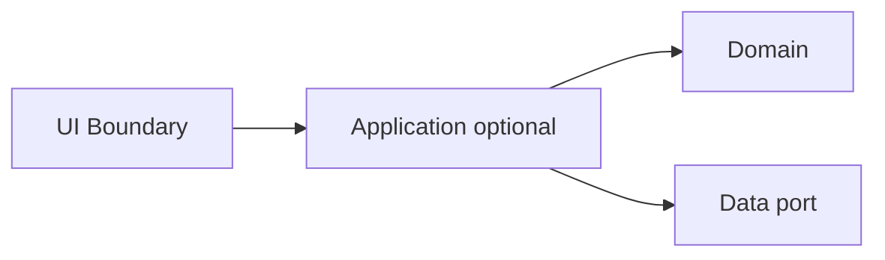

# Magic Square (4×4): Layer Design, Contracts, and TDD Report

**Scope of this document:** Logic (domain) layer design, UI boundary design, data layer design, integration and verification plans, and traceability.  
**Excluded by intent:** Executable implementation code; algorithm implementation detail beyond contracts.

**Project goal:** Practice layer separation, contract-based testing, and refactoring more than algorithm difficulty.

## Provenance

| Artifact | Role |
|----------|------|
| [Prompting/02.layer-design-contracts-tdd-report-prompt.md](../Prompting/02.layer-design-contracts-tdd-report-prompt.md) | Brief, fixed I/O contracts, required outline, and step-by-step design chat |

**ECB alignment (this repository):** Logic (domain) corresponds to **entity**; optional application orchestration corresponds to **control**; screen and persistence adapters correspond to **boundary** and outward ports.

**Input contract (fixed):**

- `4×4 int[][]`; `0` = empty cell.
- Exactly **2** empty cells.
- Value range: `0` or `1–16`.
- No duplicates except `0`.

**Output contract (fixed):**

- `int[6]`; coordinates **1-indexed**.
- Format: `[r1, c1, n1, r2, c2, n2]`.
- `n1`, `n2` are the two missing numbers; if `(smaller → first blank, larger → second blank)` completes a magic square, return in that order; **otherwise reverse**.

---

## Document map

| Section | Content |
|--------|---------|
| [1. Logic layer (domain)](#1-logic-layer-domain-layer-design) | Concepts, invariants, use cases, domain API, domain unit tests |
| [2. Screen layer (UI boundary)](#2-screen-layer-ui-layer-design-boundary-layer) | Scenarios, external contract, UI tests, error wording |
| [3. Data layer](#3-data-layer-design) | Purpose, port contract, storage options, data tests |
| [4. Integration and verification](#4-integration--verification) | Flow, integration scenarios, regression rules, coverage, traceability matrix |

---

# 1) Logic Layer (Domain Layer) design

## 1.1 Domain concepts

| Type | Name | Single responsibility |
|------|------|-------------------------|
| Value Object | `Grid4x4` (or equivalent) | Holds a 4×4 integer matrix; structural role only if split from partial-square rules. |
| Value Object | `CellCoordinate` | Row and column as 1-based integers in range 1–4; equality and ordering for first/second blank. |
| Value Object | `Placement` | Pair `(CellCoordinate, value)` with value in 1–16. |
| Entity / Aggregate root | `PartialMagicSquare` | Puzzle state: exactly two cells `0`, other cells `1–16` without duplicate; exposes ordered blanks and candidate missing values. |
| Domain Service | `MagicSquareCompletenessChecker` | Given a full 4×4 (no zeros), decides whether all row sums, column sums, and both main diagonals equal the magic constant for order 4. |
| Domain Service | `SolutionOrderingPolicy` | Given ordered blanks `(b1, b2)`, missing numbers `{a, b}` with `a < b`, decides output `(n1, n2)` per the stated completion rule. |
| Domain Service (optional) | `MissingNumbersResolver` | From filled cells, computes which two integers in 1–16 are absent. |

**SRP checklist**

- [ ] No domain type both parses raw `int[][]` and checks magic sums (boundary parses/validates structure; domain receives validated structure or fails at boundary).
- [ ] Ordering of blanks is defined in one place (domain policy), not duplicated in UI.
- [ ] Magic constant and sum rules live only in completeness checker (or one shared `MagicConstant` value object read by checker).

## 1.2 Domain invariants

| ID | Invariant | Verifiable by |
|----|------------|----------------|
| D1 | Grid order is 4×4. | Assert dimensions 4 and 4. |
| D2 | Exactly two cells contain `0`; all other cells contain 1–16. | Count zeros = 2; every non-zero in [1, 16]. |
| D3 | No duplicate values among non-zero cells. | Set size of non-zero values = 14. |
| D4 | The multiset of placed values ∪ `{n1, n2}` equals `{1,…,16}` exactly once each in the **completed** square used for the magic check. | After hypothetical fill, 16 distinct values 1–16. |
| D5 | Magic constant for order-4 normal magic square using 1–16 is **34** (every row, column, both main diagonals on the completed grid). | Sum assertions on completed grid. |
| D6 | Output ordering rule: Let blanks be `b1` then `b2` in **blank order** (D7). Let missing be `a < b`. If assigning `a→b1` and `b→b2` yields a grid satisfying D5 (and D4), then `(n1, n2) = (a, b)`; else `(n1, n2) = (b, a)`. For well-posed fixtures, **exactly one** of these two assignments succeeds. | Two deterministic checks; assert exactly one true for golden puzzles. |
| D7 | **Blank order:** `b1` is the lexicographically first `(row, col)` in **1-based** row-major order among cells with value `0`. `b2` is the second. | Positions match sorted list of zero coordinates. |

## 1.3 Core use cases (domain view)

| Use case | Preconditions | Postconditions |
|----------|---------------|----------------|
| UC-D1 Locate ordered blanks | D2 holds | Returns `(b1, b2)` per D7 |
| UC-D2 Resolve missing numbers | D2, D3 hold | Returns `{a, b}` with `a < b`, both in 1–16, absent from grid |
| UC-D3 Check completed magic | Full grid, no zeros | Boolean per D5 |
| UC-D4 Evaluate placement `(a→b1, b→b2)` | Blanks and `{a, b}` known | Temporary full grid satisfies D4 and D5 or not |
| UC-D5 Decide `(n1, n2)` | Same as D6 | `(n1, n2)` matches D6 |

## 1.4 Domain API (internal contract)

Signatures are descriptive only (no implementation bodies).

| Operation | Input | Output | Success | Failure conditions |
|-----------|--------|--------|---------|---------------------|
| `createPartialMagicSquare(matrix)` | 4×4 ints, structurally valid per boundary or explicit validation | `PartialMagicSquare` | D2, D3 satisfied | Violation of D1–D3: **invalid partial square** (typed failure) |
| `orderedBlankCells(partial)` | Valid `PartialMagicSquare` | Ordered pair `(b1, b2)` | Always | None if partial valid |
| `missingTwoNumbers(partial)` | Valid partial | Pair `(a, b)` with `a < b` | Always | If not exactly two missing: **inconsistent partial** (unreachable if D2–D3 hold) |
| `isCompletedMagicSquare(fullGrid)` | 4×4, no zeros, values 1–16 | Boolean | Deterministic | Any cell `0`: **not full** |
| `tryAssignment(partial, smallerToFirstBlank)` | Valid partial; boolean: if true, assign smaller to `b1`, larger to `b2`; else swap | Boolean “is magic” | Deterministic | — |
| `resolveOutputNumbers(partial)` | Valid partial | `(n1, n2)` per D6 | Exactly one assignment works for well-posed input | Neither: **unsolvable**; both: **ambiguous** (policy: reject; test if injected) |

**Failure types (domain-level)**

- `InvalidPartialStructure`
- `NotFullGrid`
- `UnsolvableAssignment`
- `AmbiguousAssignment` (optional: reject if both assignments valid)

## 1.5 Domain unit test design (RED first)

| ID | Kind | Setup | Expected | Invariant protected |
|----|------|--------|----------|----------------------|
| T-D01 | Normal | Known solvable partial with unique magic completion | `isCompletedMagicSquare` true on completed grid | D5 |
| T-D02 | Normal | Puzzle where `(a→b1, b→b2)` works | `(n1, n2) = (a, b)` | D6 |
| T-D03 | Normal | Puzzle where only swapped assignment works | `(n1, n2) = (b, a)` | D6 |
| T-D04 | Edge | Blanks at varied positions | `orderedBlankCells` matches row-major 1-based | D7 |
| T-D05 | Edge | Blanks on same row | Order still row-major | D7 |
| T-D06 | Abnormal | Three zeros (if forced internally) | `InvalidPartialStructure` | D2 |
| T-D07 | Abnormal | Duplicate non-zero | `InvalidPartialStructure` | D3 |
| T-D08 | Abnormal | Value 17 | `InvalidPartialStructure` | D2 |
| T-D09 | Abnormal | Completed grid wrong diagonal sum | `isCompletedMagicSquare` false | D5 |
| T-D10 | Abnormal | Both assignments magic (injected) | `AmbiguousAssignment` or documented choice | D6 uniqueness |
| T-D11 | Abnormal | Neither assignment magic | `UnsolvableAssignment` | D6 |
| T-D12 | Normal | `missingTwoNumbers` on 14 distinct filled | Correct `{a, b}` | D4 |

**RED checklist**

- [ ] Write T-D02 before production helpers for ordering.
- [ ] Write T-D04 before blank-scan implementation.
- [ ] Each test name references rule ID where useful (e.g. `D6_prefers_smaller_first_when_valid`).

---

# 2) Screen Layer (UI Layer) design (Boundary Layer)

## 2.1 User/caller scenarios

| Step | Actor | Action | System response |
|------|--------|--------|------------------|
| 1 | Caller | Supplies `int[][]` (4×4) | — |
| 2 | Boundary | Validates input schema | On failure: error schema; stop |
| 3 | Boundary | Maps to domain input | On domain failure: error schema |
| 4 | Boundary | Maps domain result to `int[6]` | On success: output schema |
| 5 | Caller | Consumes `int[6]` or error | — |

**Flow checklist**

- [ ] Freeze one rule: domain uses 0-based or 1-based internally; boundary maps to **1-based** output contract. Document in integration; test in T-U12 / T-I01.

## 2.2 UI contract (external contract)

### Input schema

| Field | Constraint | Violation code |
|-------|------------|----------------|
| `matrix` | Non-null | `E_NULL_INPUT` |
| `matrix.length` | Equals 4 | `E_WRONG_SIZE` |
| Each row | Non-null, `length == 4` | `E_WRONG_SIZE` |
| Every cell `v` | `v == 0` or `1 <= v <= 16` | `E_VALUE_RANGE` |
| Count of `v == 0` | Exactly 2 | `E_BLANK_COUNT` |
| Non-zero values | All distinct | `E_DUPLICATE_VALUE` |

### Output schema (success)

| Index | Meaning | Constraint |
|-------|---------|------------|
| 0 | `r1` | Integer in 1–4 |
| 1 | `c1` | Integer in 1–4 |
| 2 | `n1` | Integer in 1–16 |
| 3 | `r2` | Integer in 1–4 |
| 4 | `c2` | Integer in 1–4 |
| 5 | `n2` | Integer in 1–16 |

**Additional success checks**

- [ ] `(r1, c1)` and `(r2, c2)` match the two zero positions in input in **blank order** D7.
- [ ] `{n1, n2}` equals domain missing pair with order per D6.

### Error schema

| Field | Type | Constraint |
|-------|------|------------|
| `code` | String enum | Codes below + `E_DOMAIN_UNSOLVABLE`, `E_DOMAIN_AMBIGUOUS`, `E_INTERNAL`, optional `E_STORAGE_CORRUPT` if UI surfaces storage |
| `message` | String | Deterministic per §2.4 |
| `details` | Optional | e.g. `{ "row": i, "col": j }` for first violation |

## 2.3 UI-level tests (contract-first, RED first; domain mocked)

| ID | Scenario | Stub domain | Assert |
|----|----------|-------------|--------|
| T-U01 | `null` matrix | Not called | `E_NULL_INPUT`, exact message |
| T-U02 | 3×3 | Not called | `E_WRONG_SIZE` |
| T-U03 | Row length 3 | Not called | `E_WRONG_SIZE` |
| T-U04 | 3 zeros | Not called | `E_BLANK_COUNT` |
| T-U05 | 1 zero | Not called | `E_BLANK_COUNT` |
| T-U06 | Cell value 17 | Not called | `E_VALUE_RANGE` |
| T-U07 | Cell value -1 | Not called | `E_VALUE_RANGE` |
| T-U08 | Duplicate non-zero | Not called | `E_DUPLICATE_VALUE` |
| T-U09 | Valid input | Return fixed tuple | `int[6]` length 6, values match stub |
| T-U10 | Domain unsolvable | Throw | `E_DOMAIN_UNSOLVABLE`, message |
| T-U11 | Domain ambiguous | Throw | `E_DOMAIN_AMBIGUOUS`, message |
| T-U12 | Coordinate mapping | Stub exposes coords | 1-based coords match zero positions row-major |

## 2.4 UX/output rules (exact wording)

| `code` | Exact `message` (literal in tests) |
|--------|-------------------------------------|
| `E_NULL_INPUT` | `Input matrix is null.` |
| `E_WRONG_SIZE` | `Matrix must be 4x4 with each row length 4.` |
| `E_VALUE_RANGE` | `Each cell must be 0 or between 1 and 16 inclusive.` |
| `E_BLANK_COUNT` | `Exactly two cells must be 0 (empty).` |
| `E_DUPLICATE_VALUE` | `Values 1 through 16 must not repeat except for 0.` |
| `E_DOMAIN_UNSOLVABLE` | `No placement of the missing numbers completes a magic square.` |
| `E_DOMAIN_AMBIGUOUS` | `Multiple valid completions exist; input is not supported.` |
| `E_INTERNAL` | `Unexpected error.` |
| `E_STORAGE_CORRUPT` (optional) | `Stored data is corrupted.` |

**Validation order (fixed)**

1. Null  
2. Size (outer length 4, each inner length 4, non-null rows)  
3. Value range (row-major first violation for `details`)  
4. Blank count  
5. Duplicates among non-zero (row-major first duplicate)

---

# 3) Data Layer design

## 3.1 Purpose

| Need | Scope |
|------|--------|
| Ports/adapters practice | Persist last **input matrix** and optionally last **successful** `int[6]` |
| No DB | Single-user, local, synchronous API |

Out of scope: multi-user concurrency, remote sync, encryption.

## 3.2 Interface contract

| Method | Input | Output | Failure |
|--------|--------|--------|---------|
| `saveSession(inputMatrix, optionalResultSix)` | `int[4][4]` after successful UI validation | `void` (or `SessionId`) | `StorageWriteError` on IO failure |
| `loadLastInput()` | None | `int[4][4]` or absent | `NoStoredSession` |
| `loadLastResult()` | None | `int[6]` or absent | `NoStoredResult` |
| `clear()` | None | `void` | IO failure |

**Stored payload**

| Key | Invariant |
|-----|-----------|
| `lastInput` | Same as input schema post-validation |
| `lastResult` | If present, matches output schema |

## 3.3 Implementation options

| Option | Pros | Cons |
|--------|------|------|
| A In-memory | Fast tests, no IO flakes | Lost on process exit |
| B File JSON | Survives restart, inspectable | Permissions, parse errors |

**Recommendation:** **Option B (JSON)** under a project path (e.g. `.magic-square/session.json`) for manual practice; **Option A** as default test double.

## 3.4 Data layer tests

| ID | Scenario | Expect |
|----|----------|--------|
| T-DS01 | Save then load input | Identical 4×4 |
| T-DS02 | Save with result, load result | Equal `int[6]` |
| T-DS03 | Load with no file | `NoStoredSession` |
| T-DS04 | Corrupt JSON | `DataFormatError` / fixed message `Stored data is corrupted.` |
| T-DS05 | Wrong outer array length | Same format error |
| T-DS06 | Inner row length not 4 | Same |
| T-DS07 | Clear then load | `NoStoredSession` |

---

# 4) Integration & Verification

## 4.1 Integration path

**Dependency direction**

- Domain: no outward dependencies.
- Application: depends on domain + data **ports** only.
- UI: depends on application (or façade); **not** on file adapter.
- Data adapter: implements port; filesystem only outward.

## 4.2 Integration test scenarios

**Success (≥2)**

| ID | Assert |
|----|--------|
| T-I01 | Valid golden partial → `int[6]` equals fixture |
| T-I02 | Valid input → save → new instance → load → same result as T-I01 |

**Failure (≥3)**

| ID | Type | Assert |
|----|------|--------|
| T-I03 | Input error | No domain call; `E_BLANK_COUNT` |
| T-I04 | Domain failure | `E_DOMAIN_UNSOLVABLE` |
| T-I05 | Data failure | Corrupt file → mapped storage error per chosen surface |

## 4.3 Regression protection rules

| Rule | Action |
|------|--------|
| Contract freeze | `int[6]` layout and 1-based coords unchanged without version bump |
| Message literals | §2.4 strings frozen unless contract v2 |
| Golden fixtures | ≥3: solvable-A (smaller-first), solvable-B (reversed), unsolvable-valid-schema |
| Test removal | Only with feature removal; prefer rename |
| Refactor | Green suite stays green; new tests before behavior change |

## 4.4 Coverage targets

| Layer | Target |
|-------|--------|
| Domain | ≥95% line (≥90% branch where tool supports) |
| UI boundary | ≥85% line |
| Data | ≥80% line |

## 4.5 Traceability matrix

| Concept (Invariant) | Rule | Use Case | Contract | Test | Component |
|--------------------|------|----------|------------|------|-----------|
| D1 4×4 | Input size | Validate input | Input schema | T-U02, T-U03, T-DS05, T-DS06 | UI Boundary, File adapter |
| D2 zeros and range | Two zeros; 0 or 1–16 | Validate input | Input schema | T-U04–U07 | UI Boundary |
| D3 no dup non-zero | Distinct among filled | Validate input | Input schema | T-U08 | UI Boundary |
| D5 magic sums = 34 | Completed check | UC-D3 | Domain API | T-D01, T-D09 | Completeness checker |
| D7 blank order | Row-major 1-based | UC-D1 | Output coords | T-D04, T-U12 | PartialMagicSquare / mapper |
| D6 output number order | smaller-first vs swap | UC-D5 | Output `n1, n2` | T-D02, T-D03 | SolutionOrderingPolicy |
| Solvability | One assignment | Solve | Success output | T-I01, T-D11 | Application + Domain |
| Persistence shape | 4×4 | Save/load | Repository | T-DS01, T-DS05 | File repository |
| Error wording | Fixed messages | Failures | Error schema | T-U01–U08, T-I03 | UI Boundary |
| Storage integrity | Valid JSON | Load | Data port | T-DS04 | File adapter |

---

## Report metadata

| Field | Value |
|-------|--------|
| Document | Layer design, contracts, TDD plan |
| Companion | `01.problem-definition-report.md` |
| Source prompt | `Prompting/02.layer-design-contracts-tdd-report-prompt.md` |
| Location | `Report/02.layer-design-contracts-tdd-report.md` |
